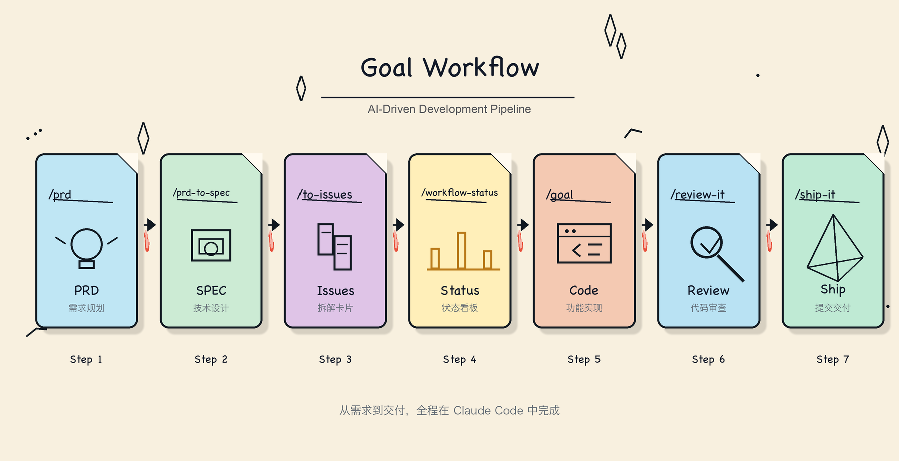

# goal-workflow

[English](./README.md) | 简体中文

一套 AI 驱动的研发工作流，从需求到代码交付，全程在 Claude Code 中完成。

```
/prd  →  /prd-to-spec (可选)  →  /to-issues  →  /goal  →  /review-it  →  /ship-it
```

<p align="center">
  
</p>

## 安装

```bash
npx skills add yinshuxun/goal-workflow
```

## 技能列表

| 命令 | 说明 |
|------|------|
| `/workflow-init` | 初始化统一 `.workflow/` 工作流产物目录 |
| `/prd` | 生成 PRD 需求文档 |
| `/prd-to-spec` | 将 PRD 转化为技术设计方案（可选） |
| `/to-issues` | 将 PRD/SPEC 拆解为 Issue 并创建卡片 |
| `/workflow-status` | 启动本地交互式工作流 dashboard、在默认浏览器打开，并默认监听 `.workflow/` 自动重建；使用 `--shell` 查看终端输出 |
| `/goal` | 端到端实现 Issue（Claude Code 内置） |
| `/verify-it` | 为 Issue 记录 fresh verification 证据 |
| `/progress-it` | 更新长期进展、历史记录和工作流索引 |
| `/resume-it` | 恢复长期工作上下文并推荐下一步 |
| `/review-it` | 自动化代码审查与迭代修复 |
| `/ship-it` | 提交、PR、合入、关闭 Issue |
| `/note-it` | 为 Issue 记录实现笔记 |
| `/humanize-it` | 文档去 AI 味改写 |
| `/listenhub-tts` | ListenHub 文本转语音 |
| `/insight-diagram` | UML 与架构图生成 |
| `/code-to-spec` | 逆向生成项目规格文档 |
| `/refactor` | 专家级代码重构（Fowler 目录） |
| `/modern-go` | Go 代码现代化改造（35+ 条规则） |
| `/smell` | 检测架构反模式、代码坏味道和复杂度热点 |

## 文档

完整使用指南：[docs/index.html](docs/index.html)

`docs/` 目录是一套可直接用于 GitHub Pages 的静态文档站点。配置 Pages 时选择 `docs/` 作为发布源，`docs/index.html` 作为入口页；入口页会按浏览器语言跳转到中文或英文指南。

`docs/workflow.png` 是 README 与 Pages 共用的工作流信息图。当前仍适合作为高层六步生命周期示意图，不需要为本轮文档更新重画；只有顶层生命周期变化时才需要重新生成，具体命令细节应维护在 HTML 指南里。

## 许可证

MIT